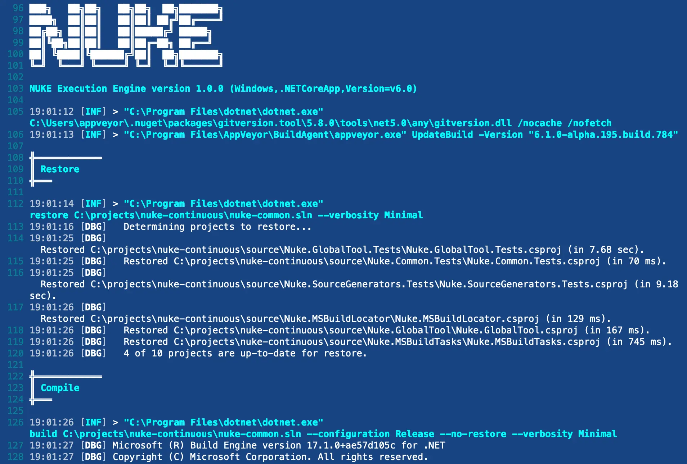
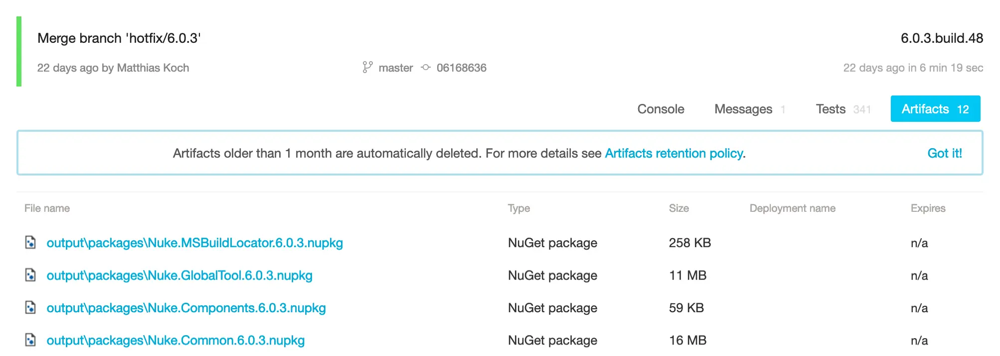

Running on [AppVeyor](https://www.appveyor.com/) will automatically enable custom theming for your build log output:



!!! info
    Please refer to the official [AppVeyor documentation](https://www.appveyor.com/docs/) for questions not covered here.

## Environment Variables

You can access [predefined environment variables](https://www.appveyor.com/docs/environment-variables/) by using the `AppVeyor` class:

```csharp
AppVeyor AppVeyor => AppVeyor.Instance;

Target Print => _ => _
    .Executes(() =>
    {
        Log.Information("Branch = {Branch}", AppVeyor.RepositoryBranch);
        Log.Information("Commit = {Commit}", AppVeyor.RepositoryCommitSha);
    });
```

A full reference of available variables and their documentation can be found [here](https://gruke-build.github.io/src/api/Nuke.Common.CI.AppVeyor.AppVeyor).

## Configuration Generation

You can generate [build pipeline files](https://appveyor.com/docs/appveyor-yml/) from your existing target definitions by adding the `AppVeyor` attribute. For instance, you can run the `Compile` target on every push with the latest Ubuntu image:

```csharp title="Build.cs"
[AppVeyor(
    AppVeyorImage.VisualStudio2022,
    InvokedTargets = new[] { nameof(Compile) })]
class Build : NukeBuild { /* ... */ }
``` 

??? "Generated output"

    ```yaml title="appveyor.yml"

    image:
      - Visual Studio 2022

    build_script:
        - cmd: .\build.cmd Compile
        - sh: ./build.cmd Compile
    ```

!!! info
    Whenever you make changes to the attribute, you have to [run the build](../getting-started/execution.md) at least once to regenerate the pipelines file.

## Artifacts

If your targets produce artifacts, like packages or coverage reports, you can publish those directly from the target definition:

```csharp
Target Pack => _ => _
    .Produces(PackagesDirectory / "*.nupkg")
    .Executes(() => { /* Implementation */ });
```

??? "Generated output"

    ```yaml title="appveyor.yml"
    artifacts:
      - path: output/packages/*.nupkg
    ```

After your build has finished, those artifacts will be listed under the artifacts tab:

<p style={{maxWidth:'900px'}} markdown="span">



</p>
