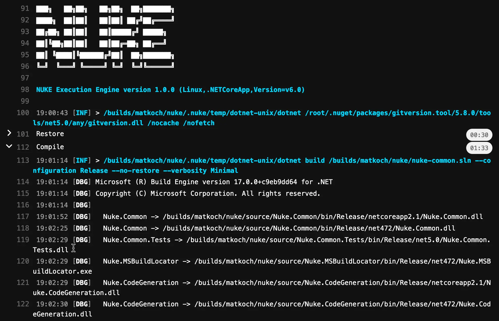

Running on [GitLab](https://about.gitlab.com/) will automatically enable custom theming for your build log output including [collapsible sections](https://docs.gitlab.com/ee/ci/jobs/#expand-and-collapse-job-log-sections) for better structuring:



!!! info
    Please refer to the official [GitLab documentation](https://docs.gitlab.com/) for questions not covered here.

## Environment Variables

You can access [predefined environment variables](https://docs.gitlab.com/ee/ci/variables/predefined_variables.html) by using the `GitLab` class:

```csharp
GitLab GitLab => GitLab.Instance;

Target Print => _ => _
    .Executes(() =>
    {
        Log.Information("Branch = {Branch}", GitLab.CommitRefName);
        Log.Information("Commit = {Commit}", GitLab.CommitSha);
    });
```

A full reference of available variables and their documentation can be found [here](https://gruke.readthedocs.io/docfx/api/Nuke.Common.CI.GitLab.GitLab.html).

## Configuration Generation

??? tip "Docker usage"
    By default, the configuration generates with a .NET SDK Docker image matching that of your GRUKE build project.
    You can have it not run in Docker by setting `UseDocker = false` (it defaults to true):
    ```csharp title="Build.cs" hl_lines="3"
    [GitLabCI(
        InvokedTargets = [nameof(Compile)],
        UseDocker = false
    )]
    class Build : NukeBuild { /* ... */ }
    ``` 

    and you can use a custom image by setting the `DockerImage` string in the attribute:

    ```csharp title="Build.cs" hl_lines="3"
    [GitLabCI(
        InvokedTargets = [nameof(InvokePythonTool)],
        DockerImage = "python:3.10"
    )]
    class Build : NukeBuild { /* ... */ }
    ```

You can generate [.gitlab-ci.yml](https://docs.gitlab.com/ci/yaml/) from your existing target definitions by adding the `GitLabCI` attribute. For instance, you can run the `Compile` target on every push with image:

```csharp title="Build.cs"
[GitLabCI(
    InvokedTargets = [nameof(Compile)]
)]
class Build : NukeBuild { /* ... */ }
``` 

??? note "Generated output"
    ```yaml title=".gitlab-ci.yml"
    image: mcr.microsoft.com/dotnet/sdk:10.0.103

    variables:
      GIT_DEPTH: 0

    stages:
      - build

    'Run: Compile':
      stage: build
      script:
        - './build.sh Compile'
    ```

!!! info
Whenever you make changes to the attribute, you have to [run the build](../getting-started/execution.md) at least once to regenerate the workflow file.

### Artifacts

If your targets produce artifacts, like packages or coverage reports, you can publish those directly from the target definition:

```csharp
Target Pack => _ => _
    .Produces(PackagesDirectory / "*.nupkg")
    .Executes(() => { /* Implementation */ });
```

Then enable artifact publishing in the `GitLabCI` attribute:

```csharp title="Build.cs" hl_lines="3"
[GitLabCI(
    InvokedTargets = [nameof(Pack)],
    UploadProducedArtifacts = true
)]
class Build : NukeBuild { /* ... */ }
```

??? tip "A note about automatic artifact publishing"
    It's entirely possible you create artifacts you don't want uploaded to any given CI provider. 
    In these cases, you can use `ExcludedArtifacts` on the `GitLabCI` attribute to exclude those files.

    ```cs title="Build.cs"
    [GitLabCI(
        InvokedTargets = [nameof(Test)],
        UploadProducedArtifacts = true,
        ExcludedArtifacts = [ "output/packages/*.nupkg" ]
    )]
    class Build : NukeBuild { /* ... */ }
    ```

    This will simply generate as shown directly below this, but with the specified artifacts removed from the `paths` section.

??? note "Generated output"

    ```yaml title=".gitlab-ci.yml"
    image: mcr.microsoft.com/dotnet/sdk:10.0.103

    variables:
      GIT_DEPTH: 0

    stages:
      - build

    'Run: Test':
      stage: build
      script:
        - './build.sh Test'
      artifacts:
        paths:
          - output/test-results/*.trx
          - output/test-results/*.xml
          - output/packages/*.nupkg
    ```

After your build has finished, those artifacts will be listed under the _Job artifacts_ section on the right side of GitLab's job UI; 
alternatively there's an 'Artifacts' tab in the same section as the other CI stuff.


<p style={{maxWidth:'900px'}} markdown="span">


</p>

## Conditional execution

By default, GitLab will run this new file for every push to every branch. You can control this with the `OnlyOnPushesToBranches` property in the `GitLabCI` attribute.
The value can be any string, and has special handling for `null`:
emitting `$CI_DEFAULT_BRANCH` in its place, allowing you to write `OnlyOnPushesToBranches = [ default ]` which reads as exactly what it does. "Only on pushes to default branch."

```csharp title="Build.cs"
[GitLabCI(
    InvokedTargets = [nameof(Compile)],
    OnlyOnPushesToBranches = [ "develop" ]
)]
class Build : NukeBuild { /* ... */ }
``` 

??? note "Generated output"
    ```yaml title=".gitlab-ci.yml"
    image: mcr.microsoft.com/dotnet/sdk:10.0.103

    variables:
      GIT_DEPTH: 0

    stages:
      - build

    'Run: Compile':
      stage: build
      script:
        - './build.sh Compile'
      rules:
        - if: $CI_COMMIT_BRANCH == 'develop'
    ```