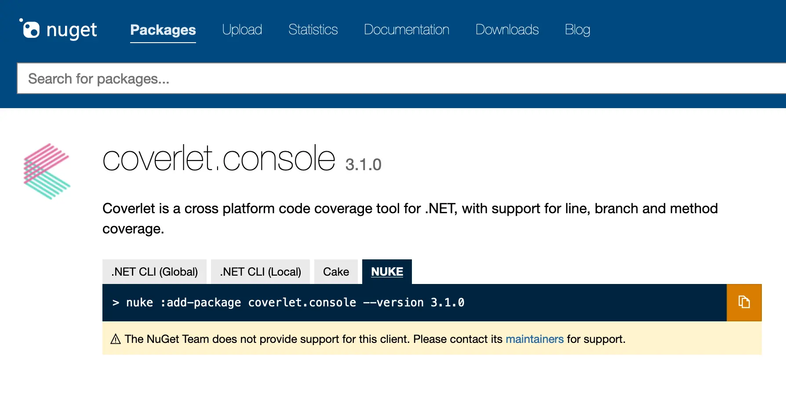

In many cases, build automation relies on third-party tools. NUKE provides you with a great [API for working with CLI tools](../common/cli-tools.md), however, it is the responsibility of a build project to reference these tools in the form of NuGet packages and define their exact versions.

You can add a NuGet package to a build project by calling:

```powershell
nuke :add-package <package-id> [--version <package-version>]
```

!!! info
    When no version is provided, the latest version will be used. The major benefit compared to the `dotnet add package` command is that NUKE will automatically determine if the package should be referenced through `PackageReference`, i.e. as a normal library, or through `PackageDownload`, i.e. [without affecting the dependency resolution graph](https://github.com/NuGet/Home/wiki/%5BSpec%5D-PackageDownload-support#solution):

    === "PackageReference"

        ```xml title="_build.csproj"
        <Project Sdk="Microsoft.NET.Sdk">

          <ItemGroup>
            <PackageReference Include="<package-id>" Version="<package-version>" />
          </ItemGroup>

        </Project>
        ```

    === "PackageDownload"

        ```xml title="_build.csproj"
        <Project Sdk="Microsoft.NET.Sdk">

          <ItemGroup>
            <PackageDownload Include="<package-id>" Version="[<package-version>]" />
          </ItemGroup>

        </Project>
        ```

## NuGet.org Instruction Tab

If you're browsing NuGet packages on [NuGet.org](https://nuget.org), you can also use the dedicated instruction tab to quickly copy the `add-package` command for the respective tool and version (only for global tools):

<p style={{maxWidth:'800px'}} markdown="span">



</p>

!!! tip
    When you're using a CLI task that depends on a NuGet package that is not yet installed, for instance `coverlet.console`, you will receive an error message with the appropriate `add-package` command:

    ```text
    Missing package reference/download.
    Run one of the following commands to install the package:
      - nuke :add-package coverlet.console --version 3.1.0
    ```
